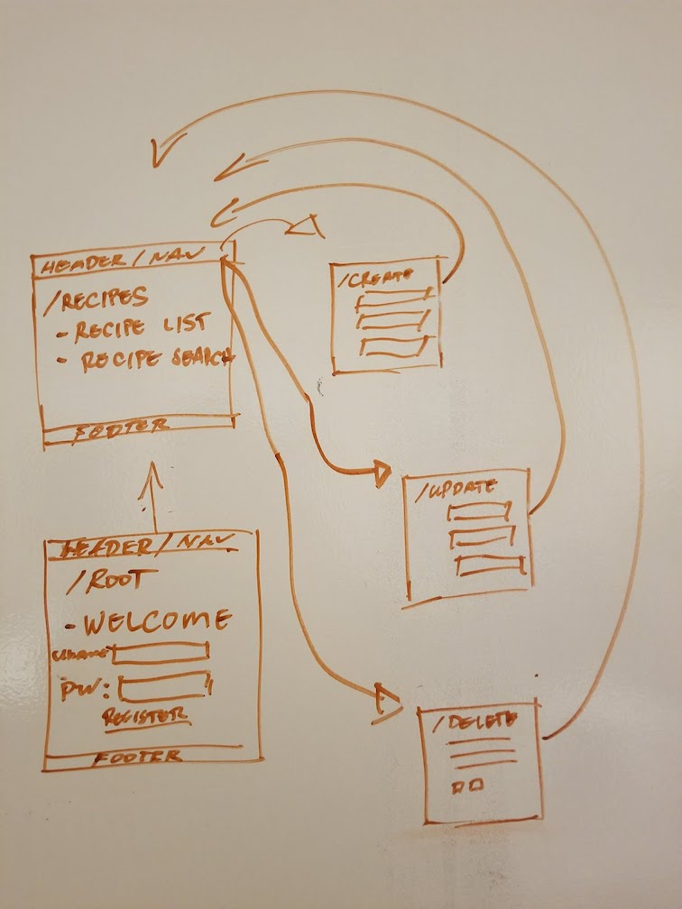
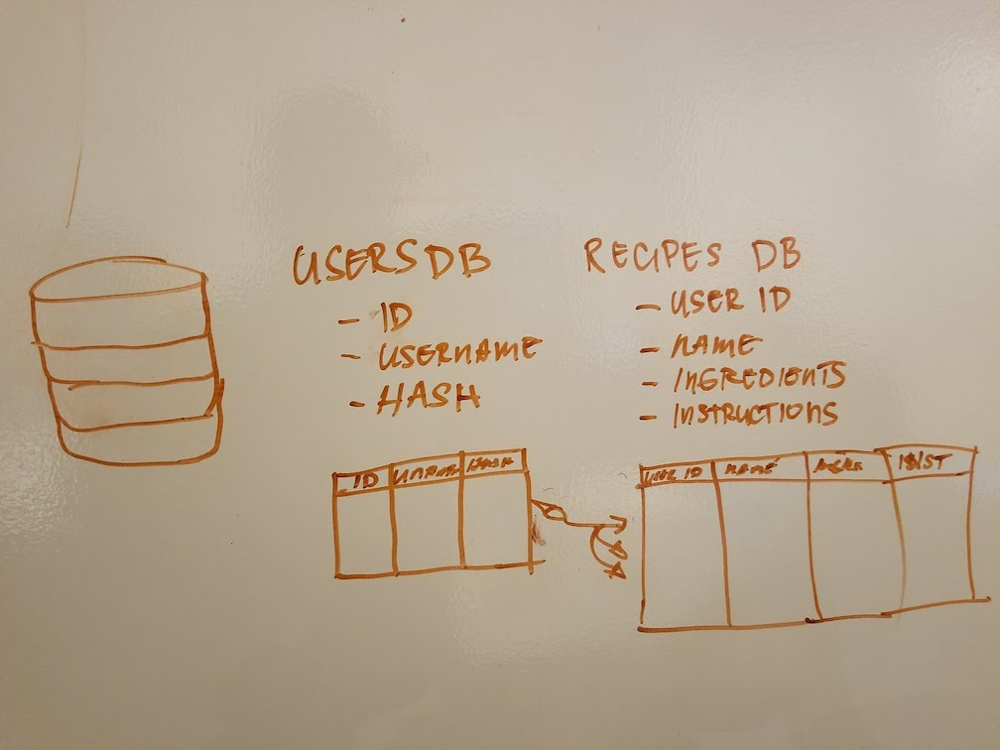

***Julius Regalado / February 25, 2018***
# Chef's Diary
## App Description
Chef's Diary is a simple application where you can manage your own recipes, with this app you will be able to create, store, edit and delete your recipes. I will also try to include a third party api where you will be able to search for recipes from an outside source.
## Wireframes

## User Stories
- Users will be able to create recipes.
- Users should be able to create and browse recipes by categories
- Users will have the option to update and/or delete.
- Users should have the option for a recipe search from 3rd party API.
## Phases of Completion
1. Backend(server side)
	- configurations and routes
2. Backend (database)
	- models and controllers
3. Frontend (JS)
	- APIs and dynamic display of information
4. Frontend 
	- EJS and CSS
5. Polishing and Debugging
## Technologies, Tools and Resources
- Programming
	- Node.js
	- Express
	- Javascript 
	- Jquery 
	- AJAX 
	- EJS
	- Bootstrap 
	- HTML 
	- CSS
- Tools
	- sublime text 3
	- git hub
	- google chrome
	- postman
- Resources
	- https://www.google.com/
	- https://www.youtube.com/
	- https://www.w3shools.com/
	- https://www.stackoverflow.com/
	- https://www.developer.mozilla.com/
